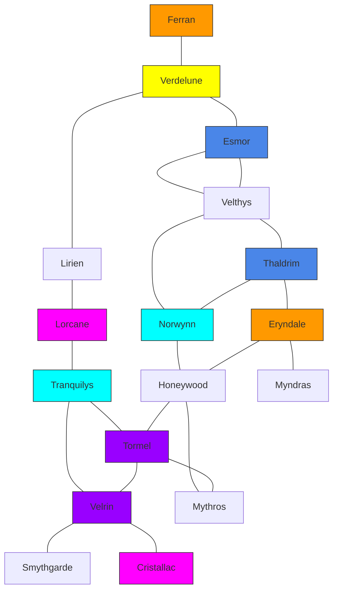

# 📍 Géographie de Sylvas

> [!info] À propos de ce document
> Ce document contient les informations sur tous les lieux importants de l'univers de Sylvas, organisés par régions, avec des détails sur les villes, mers, et caractéristiques géographiques.

## 📑 Table des matières
- [[#Royaumes et Régions Principales]]
  - [[#Empire de Nadan (Nord-Ouest)]]
  - [[#Consulat de Syrmalis (Centre-Est)]]
  - [[#Royaume de Kael'Thir (Sud)]]
  - [[#Royaume de Mobia (Sud-Ouest)]]
  - [[#L'Est Sauvage]]
- [[#Mers et Océans]]
- [[#Caractéristiques Géographiques]]
- [[#Sites Remarquables]]
- [[#Notes sur les Régions]]

---

## Royaumes et Régions Principales

### Empire de Nadan (Nord-Ouest)
> [!note] Contexte historique
> Empire puissant du nord-ouest, centre d'interdiction de la magie et à l'architecture militaire dominante.

#### Villes principales
- **Dornheim**
  - **Type** : Ville fortifiée
  - **Caractéristiques** : Architecture militaire

- **Varensk** 
  - **Type** : Ville frontalière du nord
  - **Essence** : Essence du froid (faire un bain d'eau froide)

- **Dravengard** 
  - **Type** : Capitale
  - **Essence** : Essence des dragons

- **Ironfeld** 
  - **Type** : Avant-poste oriental
  - **Fonction** : Défense frontalière

- **Greomar** 
  - **Type** : Ville côtière
  - **Économie** : Commerce maritime

- **Roulang** 
  - **Type** : Centre urbain
  - **Particularité** : À développer

- **Rathspod** 
  - **Type** : Ville portuaire
  - **Économie** : Commerce maritime

- **Yardstad** 
  - **Type** : Ville méridionale
  - **Particularité** : À développer

- **Ulmere** 
  - **Type** : Ville frontalière avec Mobia
  - **Particularité** : Point de passage

#### Sites notables
- **Ferran, Ville Scindée**
  - **Statut** : Ville divisée entre Nadan et Syrmalis
  - **Histoire** : Ferran est une cité divisée : l'**Ouest sous contrôle de l'Empire de Nadan**, l'**Est sous autorité du Consulat de Syrmalis**. Cette séparation découle d'une ancienne guerre où le père de l'empereur actuel avait conquis plusieurs villes du nord, dont **Esmor, Verdelune, Lirien, Lorcane & Tranquilys**, avant que Syrmalis ne les reprenne grâce à la grosse bataille de Cristallac, forçant Nadan à abdiquer et à céder une partie de Ferran.
  - **Importance stratégique** : Désormais, la ville est une **voie d'évasion pour les opposants au régime impérial**, attisant les tensions. L'Empereur, soucieux de préserver son pouvoir, cherche à éliminer ces rebelles, **par la coopération du Consulat ou par la force si nécessaire**.

---

### Consulat de Syrmalis (Centre-Est)
> [!note] Contexte politique
> Consulat prospère au centre-est, mélange de commerce et de culture, vainqueur de l'impératrice Thalia.

#### Système politique
- **Gouvernement** : Consulat dirigé par six consuls
- **Situation actuelle** : Siège de la Justice vacant, entraînant une paralysie politique

#### Les Consuls de Syrmalis
1. **Consul de la Diplomatie : Veylin Rathen** (30 ans)
   - Homme aux traits fins, souvent vêtu d'habits élégants et sobres
   - Cherche à maintenir la paix avec [[#Empire de Nadan (Nord-Ouest)|Nadan]] mais fait face à des oppositions internes
   - Réputé pour son éloquence, mais certains le jugent trop idéaliste

2. **Consul de la Défense : Selvia Kardin** (38 ans, humaine)
   - Femme aux cheveux sombres et au regard perçant, souvent en tenue militaire
   - Elle pousse à renforcer l'armée et se méfie des négociations de Veylin
   - Appréciée par les soldats, mais critiquée pour son approche belliqueuse

3. **Consul de l'Économie : Davian Orvalis** (44 ans)
   - Marchand prospère aux vêtements luxueux et à la voix mielleuse
   - Influence majeure sur le commerce et la fiscalité de Syrmalis
   - Il s'oppose aux réformes sociales et protège les intérêts des grandes familles

4. **Consul des Arts et de la Culture : Lyanna Thelem** (36 ans)
   - Femme raffinée aux longs cheveux auburn, habillée avec goût
   - Protectrice des érudits, des artistes et des architectes de la ville
   - Souhaite moderniser la cité par le savoir et la créativité

5. **Consul des Ressources et de l'Approvisionnement : Jorik Tandrel** (50 ans)
   - Homme trapu et pragmatique, souvent vu sur les docks ou dans les entrepôts
   - Responsable des vivres, de l'eau et du ravitaillement de la ville
   - Déteste la bureaucratie et préfère les solutions directes et efficaces

6. **Consul de la Justice** : Poste vacant

#### Villes principales
- **Velthys**
  - **Type** : Capitale
  - **Particularité** : Centre politique du Consulat

- **Honeywood**
  - **Type** : Village
  - **Économie** : Production de miel
  - **Notable** : Maire Molaire

- **Tormel**
  - **Type** : Village agricole
  - **Particularité** : Fécondité (champs, bovin, problème pour enfanter)
  - **Gouvernance** : Seigneurie Mera
  - **Essence** : Essence de la vie

- **Caltheris**
  - **Type** : Île Prison
  - **Fonction** : Détention de prisonniers

- **Tranquilys**
  - **Type** : Village artisanal
  - **Économie** : Fabrication de poteries et céramiques d'art
  - **Géographie** : Traversé par le ruisseau **Zareth**

- **Cristallac**
  - **Type** : Ville historique
  - **État actuel** : Dévasté par la guerre contre [[#Empire de Nadan (Nord-Ouest)|Nadan]]
  - **Géographie** : Traversé par le ruisseau **Elvéa**
  - **Histoire** : Site de la bataille contre Thalia

- **Velrin**
  - **Type** : Village rural
  - **Économie** : Élevage de bovins
  - **Géographie** : Traversé par le ruisseau **Eryon**

> [!info] Caractéristique hydrographique
> Ces 3 villes (Tranquilys, Cristallac et Velrin) ont chacune un cours d'eau qui remonte vers la montagne appelée "Syréna".

- **Esmor**
  - **Type** : Port
  - **Économie** : Conception de bateaux rapides
  - **Noble** : Seigneur Varek

- **Verdelune**
  - **Type** : Ville artisanale
  - **Économie** : Fabrication d'instruments de musique

- **Norwyn**
  - **Type** : Port
  - **Économie** : Pêche et commerce maritime
  - **Noble** : Seigneur Aldwin

- **Lique**
  - **Type** : Marché
  - **Économie** : Commerce d'épices exotiques
  - **Essence** : Essence de l'eau

- **Lorcane**
  - **Type** : Centre d'exploration
  - **Particularité** : Cartographie et exploration

- **Smythgarde**
  - **Type** : Centre artisanal
  - **Économie** : Forges spécialisées en armures lourdes

- **Mythros**
  - **Type** : Centre minier
  - **Économie** : Extraction de minerais rares & Commerce de pierres précieuses

- **Eryndale**
  - **Type** : Village rural
  - **Économie** : Élevage de chevaux robustes

- **Lirien**
  - **Type** : Ville frontalière
  - **Particularité** : Centre de chasse aux monstres

- **Thaldrim**
  - **Type** : Village côtier
  - **Économie** : Pêche et construction navale

#### Carte des routes commerciales et connexions

> [!info] Routes du Consulat
> Ce diagramme représente les connexions directes entre les villes du Consulat de Syrmalis. Les villes sont colorées selon leur accès aux différentes mers.

> [!tip] Légende des ports
> - 🔵 **Bleu**: Ports de l'Océan des tempêtes (Thaldrim, Velthys, Esmor, Caltheris)
> - 🟡 **Jaune**: Port de la Mer de la sérénité (Verdelune)
> - 🔹 **Cyan**: Ports de la Mer de la tranquillité (Norwynn, Tranquilys)
> - 🟣 **Violet**: Ports de la Mer de la fécondité (Tormel, Velrin)
> - 🟪 **Magenta**: Ports de la Mer des crises (Cristallac, Lorcane)
> - 🟠 **Orange**: Villes frontalières (Ferran, Lirien, Eryndale)

> [!tip] Utilisation pour les voyageurs
> Les routes sont généralement bien entretenues entre les villes principales. Comptez environ une journée de voyage entre deux villes connectées, deux à trois si le terrain est difficile ou si les conditions météorologiques sont mauvaises. Les voyages maritimes entre ports de la même mer sont plus rapides que les routes terrestres.

---

### Royaume de Kael'Thir (Sud)
> [!note] Royaume de l'Opulence
> Royaume montagneux riche en ressources minérales, lieu de résidence historique de Zareth.

#### Gouvernance
- **Dirigeant** : Roi Elwyn

#### Caractéristiques
- Protégé par de **hautes montagnes**, rendant ses terres difficiles d'accès
- **Commerce florissant** entretient de solides relations avec **[[#Royaume de Mobia (Sud-Ouest)|Mobia]] et [[#Consulat de Syrmalis (Centre-Est)|Syrmalis]]**
- Le royaume tient farouchement à son **indépendance**
- Habitants vivant dans un confort rare
- **Seul exportateur d'objets magiques**, privilège rendu possible par **Zareth, fils de Myros**

#### Personnage notable
- **Zareth, fils de Myros**
  - **Occupation** : Façonne la terre en artefacts aux pouvoirs uniques
  - **Particularité** : Peu concerné par les affaires du monde, se consacre entièrement à son art
  - **Relation avec le royaume** : Reçoit le luxe offert par le **Roi de Kael'Thir** en échange de ses créations

#### Villes principales
- **Artae**
  - **Type** : Ville de montagne
  - **Particularité** : À développer

- **Orvain**
  - **Type** : Ville historique
  - **Particularité** : Site de l'atelier de Zareth
  - **Essence** : Essence de la terre

- **Dravenn**
  - **Type** : Porte sud du royaume
  - **Fonction** : Contrôle des accès

- **Goldcone**
  - **Type** : Ville minière
  - **Économie** : Extraction de métaux précieux

- **Zarhel**
  - **Type** : Ville d'altitude
  - **Essence** : Essence de l'air (vent)

- **Velmara**
  - **Type** : Port majeur
  - **Essence** : Essence du pouvoir

---

### Royaume de Mobia (Sud-Ouest)
> [!note] Territoire mystérieux
> Peu d'informations disponibles sur cette région à la culture distincte.

#### Villes connues
- **Norgon**
  - **Type** : Capitale
  - **Particularité** : Visible sur la carte

- **Ildhaven**
  - **Type** : Centre de savoir
  - **Essence** : Essence du savoir

- **Noryon**
  - **Type** : Ville lumineuse
  - **Essence** : Essence de la lumière

---

### L'Est Sauvage
> [!note] Origine
> Créé par **Eryon** lorsqu'il a fui vers l'Est avec sa famille et d'autres proches.

#### Villes principales
- **Thorin**
  - **Type** : Ville orientale
  - **Essence** : Essence du feu

- **Cindrel**
  - **Type** : Centre magique
  - **Essence** : Essence de la magie

- **Arden**
  - **Type** : Village forestier
  - **Essence** : Essence des animaux

---

## Mers et Océans

### Mers du Nord
- **Mer des écumes**
- **Mer du froid**
- **Mer des vapeurs**
- **Mer marginale**

### Mers Centrales
- **Mer de la sérénité**
- **Mer des crises**
- **Mer de la tranquillité**
- **Mer de la fécondité**
- **Mer du nectar**

### Mers de l'Ouest
- **Océan des tempêtes**
- **Mer des humeurs**
- **Mer de la connaissance**
- **Mer des ondes**

### Mers de l'Est
- **Mer de Smith**
- **Mer orientale**
- **Mer de l'ingéniosité**

---

## Caractéristiques Géographiques

### Montagnes et Reliefs
- **Chaînes montagneuses de Kael'Thir**
- **Montagnes du Nord**
- **Montagnes de l'Est**
- **Volcan de Theria**

### Forêts
- **Forêts du Nord**
- **Forêts de Syrmalis**
- **Bois de l'Est**

### Cours d'Eau
- **Réseau fluvial de Nadan**
- **Rivières de Syrmalis**
  - Ruisseau **Zareth** (Tranquilys)
  - Ruisseau **Elvéa** (Cristallac)
  - Ruisseau **Eryon** (Velrin)
- **Cours d'eau de Kael'Thir**

---

## Sites Remarquables

### Lieux Historiques
- **Atelier de Zareth à Orvain**
  - **Importance** : Lieu de création des objets magiques
  - **Accès** : Strictement contrôlé

- **Champ de bataille de Cristallac**
  - **Événement** : Bataille décisive contre l'impératrice Thalia
  - **État actuel** : Ville en reconstruction

- **Temples et sanctuaires**
  - *À détailler*

### Points Stratégiques
- **Ports principaux**
  - **Norwyn** (Syrmalis)
  - **Rathspod** (Nadan)
  - **Velmara** (Kael'Thir)

- **Forteresses côtières**
  - *À détailler*

- **Routes commerciales**
  - Entre [[#Consulat de Syrmalis (Centre-Est)|Syrmalis]] et [[#Royaume de Kael'Thir (Sud)|Kael'Thir]]
  - Entre [[#Royaume de Mobia (Sud-Ouest)|Mobia]] et [[#Royaume de Kael'Thir (Sud)|Kael'Thir]]
  - Routes maritimes du Nord

---

## Notes sur les Régions

### Nadan
- Empire puissant du nord-ouest
- Centre d'interdiction de la magie
- Architecture militaire dominante

### Syrmalis
- Consulat prospère
- Mélange de commerce et de culture
- Vainqueur de l'impératrice Thalia

### Kael'Thir
- Royaume montagneux
- Lieu de résidence historique de Zareth
- Riche en ressources minérales

### Mobia
- Territoire mystérieux à l'ouest
- Peu d'informations disponibles
- Culture distincte

> [!todo] À développer
> - Détails sur les cultures locales de chaque région
> - Histoire complète des conflits entre Nadan et Syrmalis
> - Description détaillée des ressources naturelles et magiques
> - Système de gouvernance complet de chaque royaume
> - Légendes et mythes associés aux lieux importants
